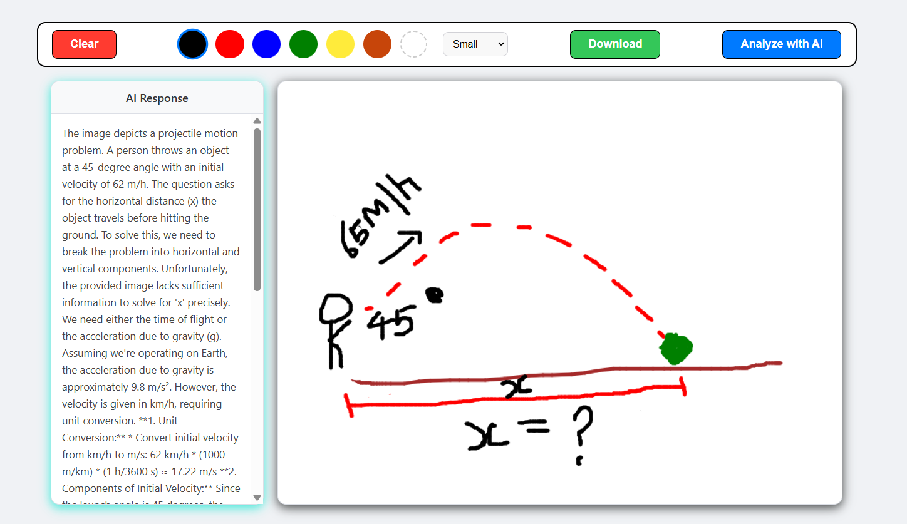
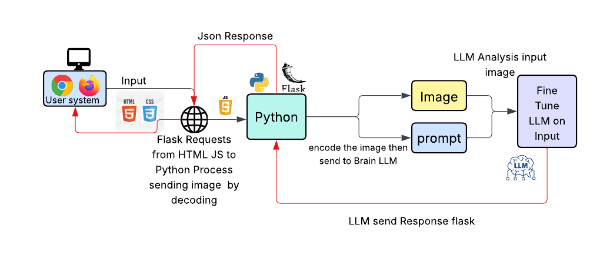

# AI-Powered Sketch Calculator

The AI-Powered Sketch Calculator is an innovative web application that transforms a simple drawing canvas into an interactive, intelligent tool. It bridges the gap between human creativity and artificial intelligence by allowing users to get real-time analysis of their sketches. Whether you draw a complex math equation, a scenic landscape, or a simple object, the application's AI backend can understand your drawing, solve problems, and provide detailed descriptions.

## Features

- Interactive Drawing Canvas: A fully-featured canvas with multiple colors, an eraser, and adjustable brush sizes.

- Multimodal AI Analysis: Submits both your drawing and an optional text prompt for more specific and accurate AI responses.

- Mathematical Equation Solving: Automatically recognizes and solves handwritten mathematical problems, providing a step-by-    step solution.

- Object & Scene Recognition: Can identify and provide detailed descriptions for sketched objects, animals, and landscapes.

- Real-Time Response: A dedicated side panel displays the AI's analysis moments after you submit your drawing.

# Tech Stack
- Frontend:
  - HTML5
  - CSS3
  - JavaScript
- Backend:
  - Python
  - Flask (as a serverless function)

- AI & Machine Learning:
  - Google Gemini 1.5 Flash
  - LangChain
- Deployment:
  - Vercel
#  

# How It Works: A Step-by-Step Guide
The project seamlessly integrates a user-facing website (the frontend) with a powerful AI brain (the backend). Here’s the journey from a sketch to a solution:

## 1. Drawing on the Canvas (Frontend)
It all starts in your web browser. The user interface, built with HTML, CSS, and JavaScript, provides a digital canvas where you can draw freely. You can select different colors, change brush sizes, and even type a specific question into the user prompt area, like "Solve for x" or "What is this object?".

## 2. Sending the Sketch for Analysis
When you click the "Analyze with AI" button, the JavaScript code springs into action. It captures your drawing from the canvas and converts it into a PNG image format. This image, along with any text you typed in the prompt box, is bundled together and sent over the internet to the backend server.

## 3. Receiving the Request (Backend)
The backend is a powerful yet lightweight server built using Python and the Flask framework. This server is designed to listen for requests from the frontend. When your drawing and prompt arrive, the Flask application receives the data and prepares it for the AI.

## 4. The AI Brain (LLM)
This is where the magic happens. The Python server uses a specialized library called LangChain to communicate with Google's advanced Gemini 1.5 Flash large language model (LLM). The LLM.py file contains the logic that formats your drawing and text into a query that the AI can understand. The AI then "looks" at the image and "reads" your prompt to figure out what you want it to do—whether that's solving an integral, identifying a landmark, or describing a butterfly.

## 5. Displaying the Result
Once the AI has generated a response, it sends the text back to the Python server. The server then relays this answer back to your browser. The JavaScript on the frontend receives the AI's response and instantly displays it in the dedicated "AI Response" panel, completing the cycle from sketch to intelligent answer in just a few seconds.
